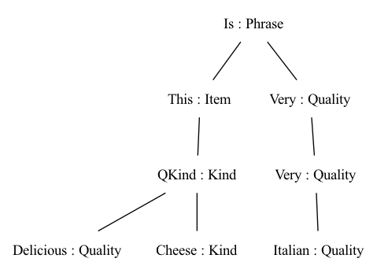
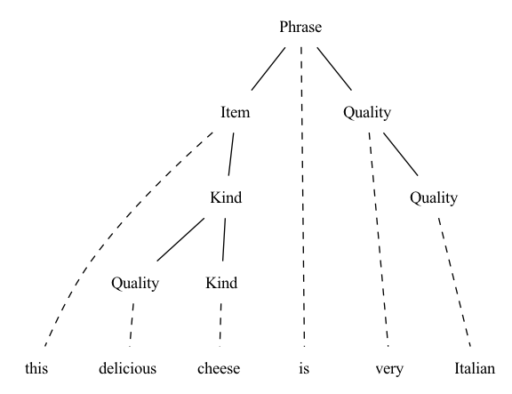
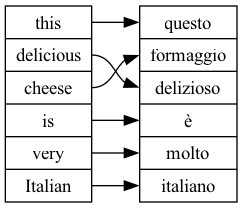

# 記録

## The abstract syntax Food

lesson01では固定のphraseだったが、lesson02ではrecursive compositionが入ってくる。

```
Food> parse "this delicious wine is very very Italian"
Is (This (QKind Delicious Wine)) (Very (Very Italian))
```

他のcategoryでparseする例：
```
Food> p -cat=Kind "very Italian wine"
QKind (Very Italian) Wine
```

```
Food> p -cat=Quality "very Italian"
Very Italian
```

## Exercises on the Food grammar
1. Extend the Food grammar by ten new food kinds and qualities, and run the parser with new kinds of examples.

abstract syntaxにKind, Qualityともに追加した。
```
Food> p -cat=Kind "very beautifle tomato"
QKind (Very Beautifle) Tomato
```

2. Add a rule that enables question phrases of the form is this cheese Italian.

abstract syntax に `IsQ : Item -> Quality -> Phrase ;` を、concrete syntax に `IsQ item quality = {s = "is" ++ item.s ++ quality.s} ;` を追加。

```
Food> p "is this cheese Italian"
IsQ (This Cheese) Italian
```

3. Enable the optional prefixing of phrases with the words "excuse me but". Do this in such a way that the prefix can occur at most once.

abstract syntax に `ExcuseMeBut : Phrase -> Phrase ;` を、concrete syntax に `ExcuseMeBut phrase = {s = "excuse me but" ++ phrase.s} ;` を追加。

```
Food> p "excuse me but is this cheese Italian"
ExcuseMeBut (IsQ (This Cheese) Italian)
```

## Generating trees and strings
parser だけじゃなく、generator としても使える。

`gr`(generate random) でランダム sentence を生成する。
```
Food> gr
IsQ (That Cheese) Italian
```

`gt`(generate tree) でASTを生成する。`-number` コマンドで生成されるASTの数を指定できる。
```
Food> gt -number=4
ExcuseMeBut (ExcuseMeBut (ExcuseMeBut (Is (That Cheese) Beautifle)))
ExcuseMeBut (ExcuseMeBut (ExcuseMeBut (Is (That Cheese) Boring)))
ExcuseMeBut (ExcuseMeBut (ExcuseMeBut (Is (That Cheese) Delicious)))
ExcuseMeBut (ExcuseMeBut (ExcuseMeBut (Is (That Cheese) Expensive)))
```

`-depth` コマンドで生成されるASTの深さを指定できる。
```
Food> gr -depth=5
ExcuseMeBut (ExcuseMeBut (ExcuseMeBut (Is (This Tomato) Warm)))
```

## Exercises on generation
1. If the command gt generated all trees in your grammar, it would never terminate. Why?

grammar に再帰的規則があるため、生成可能な AST が無限個になるから。

2. Measure how many trees the grammar gives with depths 4 and 5, respectively. Hint. You can use the Unix word count command wc to count lines.

```
$ echo "gt -depth=4" | gf --run FoodEng.gf | wc -l
   53537
$ echo "gt -depth=5" | gf --run FoodEng.gf | wc -l
 1382977
```

## More on pipes: tracing
`-tr` オプションコマンドでトレース出力することができる。
生成した文字列をもう一度 parse して、複数の tree が出るか調べれば、grammar の ambiguity が分かる。

```
Food> gr -tr | l -tr | p
ExcuseMeBut (ExcuseMeBut (ExcuseMeBut (IsQ (That Wine) Beautifle)))
excuse me but excuse me but excuse me but is that wine beautifle
ExcuseMeBut (ExcuseMeBut (ExcuseMeBut (IsQ (That Wine) Beautifle)))
```

### Exercise. Extend the Food grammar so that it produces ambiguous strings, and try out the ambiguity test.

abstract syntax に `Fun`, `Good` を追加し、concrete syntaxで同じ文字列`good`にする。

```
Food> p -tr "this cheese is good" | l -tr | p -tr
Is (This Cheese) Fun
Is (This Cheese) Good

this cheese is good
this cheese is good

Is (This Cheese) Fun
Is (This Cheese) Good

Is (This Cheese) Fun
Is (This Cheese) Good

Is (This Cheese) Fun
Is (This Cheese) Good

Is (This Cheese) Fun
Is (This Cheese) Good
```

## Writing and reading files

- `write_file = wf` コマンドでファイルに保存できる。

```
Food> gr -number=10 | l | wf -file=exx2.tmp
```

- `read_file = rf` コマンドでファイル読み込みできる。`-lines` フラグでGFに1行ずつ読むよう指定できる。

```
Food> rf -file=exx.tmp -lines | p
```

## Visualizing trees

- `visualize_tree(vt)` コマンドでツリーの可視化ができる。以下の実行で`.dot`ファイルができる。`-view=open` オプションをつけると、`png`として表示される。

```
Food> parse "this delicious cheese is very Italian" | visualize_tree
graph {
n0[label = "Is : Phrase", style = "solid", shape = "plaintext"] ;
n0_0[label = "This : Item", style = "solid", shape = "plaintext"] ;
n0 -- n0_0 [style = "solid"];
n0_0_0[label = "QKind : Kind", style = "solid", shape = "plaintext"] ;
n0_0 -- n0_0_0 [style = "solid"];
n0_0_0_0[label = "Delicious : Quality", style = "solid", shape = "plaintext"] ;
n0_0_0 -- n0_0_0_0 [style = "solid"];
n1_0_0_0[label = "Cheese : Kind", style = "solid", shape = "plaintext"] ;
n0_0_0 -- n1_0_0_0 [style = "solid"];
n1_0[label = "Very : Quality", style = "solid", shape = "plaintext"] ;
n0 -- n1_0 [style = "solid"];
n0_1_0[label = "Italian : Quality", style = "solid", shape = "plaintext"] ;
n1_0 -- n0_1_0 [style = "solid"];
}
```




- `visualize_parse` オプションをつけると、parse treeもみることができる。

```
Food> parse "this delicious cheese is very Italian" | visualize_parse -view=open
```




## An Italian concrete syntax

- FoodIta.gf を追加。`align_words` コマンドで Multilingual grammars の対応をみることができる。

```
Food> parse "this delicious cheese is very Italian" | align_words -view=open
```



## Exercises on multilinguality

1. Write a concrete syntax of Food for some other language. You will probably end up with grammatically incorrect linearizations - but don't worry about this yet.

- `FoodJpn.gf` を作成

2. If you have written Food for German, Swedish, or some other language, test with random or exhaustive generation what constructs come out incorrect, and prepare a list of those ones that cannot be helped with the currently available fragment of GF. You can return to your list after having worked out Lesson 3.

```
Food> p -lang=FoodEng "this cheese is Italian" | l -lang=FoodJpn
この チーズ は イタリア風
```


## Free variation

- 意味は同じだけど、表現だけ違うものを導入する

`Delicious = {s = "delicious" | "exquisit" | "tasty"} ;`に変更。

```
Food> p -lang=FoodEng "this exquisit wine is delicious"
Is (This (QKind Delicious Wine)) Delicious

Food> p "this exquisit wine is delicious" | l -lang=FoodEng -all
this delicious wine is delicious
this delicious wine is exquisit
this delicious wine is tasty
this exquisit wine is delicious
this exquisit wine is exquisit
this exquisit wine is tasty
this tasty wine is delicious
this tasty wine is exquisit
this tasty wine is tasty
```

## Context-free grammars and GF

- GF は abstract syntax(AST) と concrete syntax(linearization) を分離している。そのため、単なるCFGより expressive な multilingual grammar を書ける。
    - permutation(語順変更): CFG だけだと、言語ごとに rule を別に作る必要があるが、GF では shared AST を各言語で別順序に linearize できる。
    - suppression(省略): AST には存在する constituent を、特定言語では surface string に出さないことができる。
    - reduplication(繰り返し): 同じ subtree を複数回 linearize できる。そのため、CFGでは表現できない copy language `{xx | x ∈ (a|b)*}` を定義できる。

### Exercise. Define the non-context-free copy language {x x | x <- (a|b)*} in GF.    
    
Copy.gf, CopyEng.gf を作成。
```
Copy> l (Copy (A (B Empty)))
a b a b
```

## Modules and files

- `.gf` は GF の source file。
- `.gfo` は compile 済みの GF Object file。
- `import` (`i`) すると `.gf` から `.gfo` が生成される。
- `.gfo` は cache として使われ、source より高速に load できる。
- GF は file modification time を見て、再compileが必要か判断する。

### import の挙動

- 同じ session で再度 `i FoodEng.gf`
  - すでに memory 上にあるので reload 不要。
- `empty` (`e`) 後に `i FoodEng.gf`
  - memory cache は消えるが `.gfo` は残るので `.gfo` を load。
- `FoodEng.gf` を少し変更後に import
  - `FoodEng.gfo` が再生成される。
- `Food.gf` を変更後に import
  - abstract syntax dependency が変わるため、`Food.gfo` と `FoodEng.gfo` の両方が再生成される。

## Using operations and resource modules

- concrete syntax でも関数を書ける。
- helper function は `oper` で定義する。
- `fun` は abstract syntax の AST constructor, `oper` は concrete syntax の補助関数。

```
oper ss : Str -> {s : Str} = \x -> {s = x} ;
```

- `StringOper.gf `を作成。`FoodEng.gf`を更新。

```
> compute_concrete prefix "in" (ss "addition")
{s = "in" ++ "addition"}
```

1. Exercise. Define an operation infix analogous to prefix, such that it allows you to write

```
infixq : Str -> SS -> SS -> SS = \p,x,y -> ss (p ++ x.s ++ y.s) ;
```

## Grammar architecture
- Old grammar を extendして、New grammar を Old grammar + New definitions として作成できる。

- `Morefood.gf` を作る。Food の定義を全部引き継いだ上で、Question, QIs, Pizza を追加する。
- `MorefoodEng.gf` を作る。

```
Morefood> p -cat=Phrase "this pizza is delicious"
Is (This Pizza) Delicious
Morefood> p -cat=Question "is this pizza delicious"
QIs (This Pizza) Delicious
Morefood> l (QIs (This Pizza) Delicious)
is this pizza delicious
```